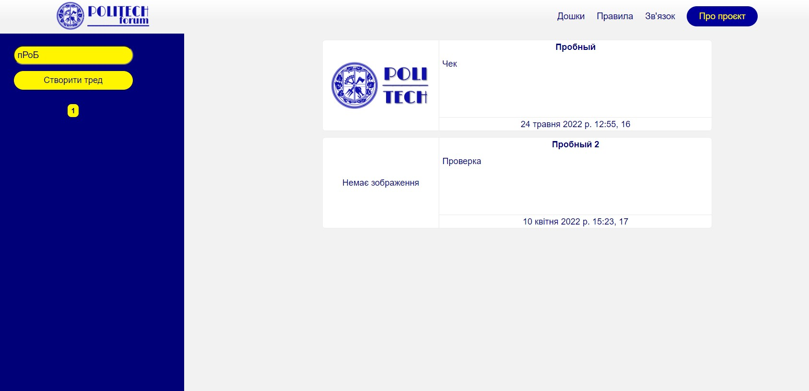

# Проєкт студентів ІО-92 Гуденка Євгенія та Уткіна Владислава

З початку семестра ми вивчали фреймворк Django, працюючи над реалізацією проєкта прототипу анонімного форуму для студентів КПІ.

## UPD: На форумі проведена українізація

### На даний момент у проєкті реалізовано:

- Базу даних дошок, тредів у цих дошках, та комментарів під цими тредами.
- Систему пошуку тредів.
- Розбиття сторінки дошки на сторінки.
- Скорочення задовгих заголовків та текстів тредів для відображення на сторінках дошок.
- Шаблонізація HTML-файлів.
- Сторінка адміністраціїї.
- Сортування тредів за часом публікації.
- Визначення тредів, що були опубліковані протягом тижня.

### Які з цілей ще не були реалізовані:

- Функціонал кнопки "Створити тред". На зараз єдиний спосіб створити тред - через сторінку адміністрації.
- Сторінку відображення комментарів.

## Скріншоти інтерфейсу та роботи елементів сайту:

Недопрацьована сторінка з коментарями:

## Контакти
- Гуденко Євгеній | zhenyahudenko@gmail.com | tg: @eugene_goode
- Уткін Владислав | vladutkin02@gmail.com | tg: @vladyslav_utkin

Репозиторій можна клонувати та перевірити працездатність локально.
